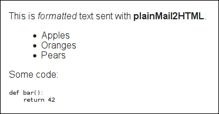

# __plainMail2HTML__

**plainMail2HTML** enables users of textual Email clients (e.g. Mutt)
to send HTML-formatted Emails.

To make this more tangible, lets assume you're using a textual Email
client, for instance the Mutt Email client. Text Emails are great and
have many advantages over HTML Email messages, but on some occasions
one might want to be able to have more control over the format of
Email messages he or she want to send. For example, you might want to
send messages with visual formatting such as bold fonts, or headings,
or bullet lists.

Another issue, sometimes even more important, is controlling the
direction of the text displayed by the recipient's Email client—when
you send plain text message, the direction in which the text will be
rendered depends on the capabilities of the Email reader used by
recipients of your Email. If you write in a *right-to-left* language,
for example *Arabic* or *Hebrew*, many current Email readers still do
not implement the Unicode Bidirectional algorithm and might render
messages you send incorrectly.

One method to overcome the above issues is using HTML Email, which can
contain formatting and text direction information. This is where
**plainMail2HTML** can be of use.

**plainMail2HTML** works as a filter—you pipe into it an Email object
that contains only a text/plain component, and out comes an Email that
contains, in addition, a text/HTML component. Markup language
directives in the original text are converted by **plainMail2HTML** to
HTML formatting elements.

From the user's perspective, using **plainMail2HTML** doesn't change
the workflow and is completely transparent—the only difference is that
markup language in your text will now be converted to HTML on the fly
when the message is sent. HTML text direction tags will be created
automatically based on the language the message is written in.

## Table of content

* [Installation](#installation)
  * [Requirements](#requirements)
  * [Configuration](#configuration)
  * [Setting up Mutt](#setting-up-mutt)
* [Usage](#usage)
* [Notes](#notes)
  * [How it works](#how-it-works)
  * [Markup Parsing Errors](#markup-parsing-errors)
  * [Limitations](#limitations)
* [Credits](#credits)
* [License](#license)

## Installation

The following sections describe how to install and configure the
system.

### Requirements

plainMail2HTML uses the Python Docutils system. On Debian systems you
can install it with:

    aptitude install python-docutils

or, if you're using python3:

    aptitude install python3-docutils

### Configuration

Usually the only setting you might need to configure is the command
that actually send the mail (if you're using Mutt, this is exactly
what you would set for Mutt's `sendmail` setting). The default used
by the system is `/usr/sbin/sendmail -oi`. If you need to change it,
create a configuration file `~/.plain2htmlrc` that sets the variable
`sendmail_cmd` to the command you want to use. For example,

    sendmail_cmd=/usr/bin/msmtp
	
A sample configuration file comes with the package in the
`doc/examples` directory.

Additional configuration, for example changing the default HTML
template or the HTML parser, can be done in the system `settings`
file.

### Setting up Mutt

To start using this system for sending Email messages with Mutt, all
you need to do is to modify the value of Mutt's `sendmail`
configuration variable—it should be set to the full path of the
`html-sendmail` script.

Assuming you installed plainMail2HTML in the directory
`~/plainMail2HTML`, you'll need to modify the `sendmail` setting in
Mutt's configuration file (usually `~/.muttrc`) to read:

    set sendmail = ~/plainMail2HTML/bin/html-sendmail

#### Some Mutt Tricks

You can setup Mutt to enable switching between sending 'standard' text
mail and HTML mail dynamically using a shortcut key.

To do that, copy the two Mutt scripts `sendmail-html.rc` and
`sendmail-plain.rc` from the `doc/examples` directory to your
`~/.mutt` directory. Then, in your `muttrc` file, replace the line

    set sendmail = ~/plainMail2HTML/bin/html-sendmail

with the line

    source ~/.mutt/sendmail-html.rc

(or, if you want plain text to be the default, source the other
script.)

Now `Control+s` will switch between the two modes. In case you prefer
a different shortcut, simply modify the two aforementioned Mutt
scripts.

The general idea this mechanism is based on is described in the
[Mutt Wiki](https://dev.mutt.org/trac/wiki/ConfigTricks#abusemacrosasvariables).

## Usage

After the system is installed and Mutt, for instance, is configured to
use it, you don't need to do anything special—you compose and send
messages in the same way you've always done. The system will add a
HTML component to each message when it is sent.

The only difference is that now you can use markup in your text to
format it. For example, if your text looks like this (reStructuredText
is used),

    This is *formatted* text sent with **plainMail2HTML**.
	
	* Apples
	* Oranges
	* Pears

	Some code::
	
	    def bar():
		    return 42

a HTML Email reader would display it like that:

## Notes

**plainMail2HTML** works nicely with Mutt, but is far from being
perfect. Here are some        technical details, issues and limitations
it has.

### How it works

plainMail2HTML works by parsing the text in the Email's text component
using predefined markup language parser that creates HTML-formatted
text. This component is then added to a copy of the original Email, so
it contains both a 'text/plain' and a 'text/html' components.

Currently the system include only reStructuredText parser, but it
should be fairly easy to add other parsing tools—the parser could be a
single Python script, and the parser used by the system is defined in
its configuration file (see the `markup` directory of this package).

However, this system was designed based on the structure of Email
objects created by Mutt. Probably it is not general enough for being
able to handle any Email created by any Email client.

### Markup Parsing Errors

Another thing to keep in mind is that improper markup format will
cause the system to produce errors. This feature is legitimate, but
could be annoying when replying to Emails you received. Text in your
reply originating from the Email you're replying to might not be in a
'correct format' from the parser point of view, and, if you leave such
text in your reply you might need to modify it in order for it to
comply (another reason for using inline replying.)

### Limitations

Although not tested, I suppose this system wont work with Emails
encrypted by Mutt.

## Credits

Credit goes to Beni Cherniavsky for writing the `hibidi.py` module,
which create the HTML bidi markup. His original code can be obtained
[here](http://cben-hacks.sourceforge.net/bidi/hibidi.py). You can read
more about it in the
[Docutils FAQ](http://docutils.sourceforge.net/FAQ.html#bidi).

I did some slight modifications to the original code to make it Python
3 compatible.

## License

This project is released under GNU General Public License v3.0.
